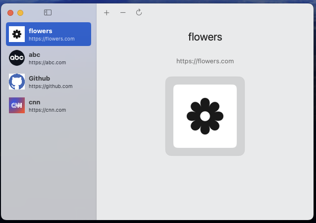
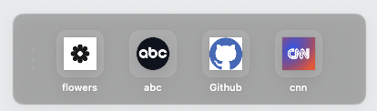
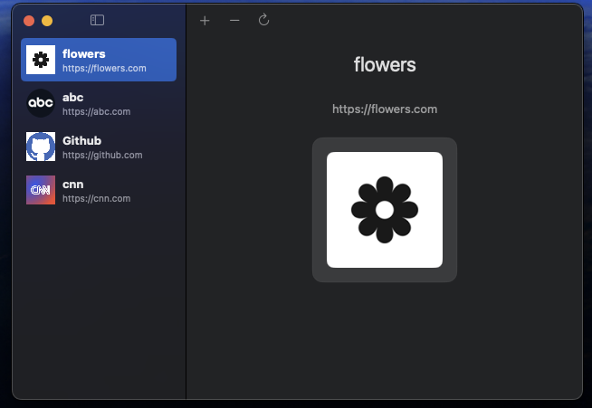
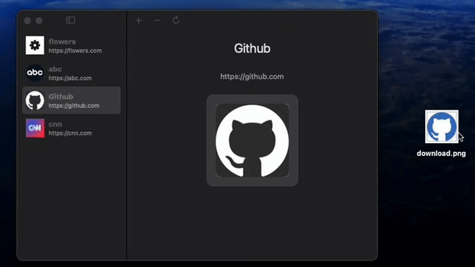

# NeoNav

[](https://developer.apple.com/xcode/swiftui/)
[](https://www.apple.com/macos/)
[](https://swift.org)
[](LICENSE)


> A lightweight, floating bookmark manager for macOS that provides instant visual access to your favorite websites.

---

#### The Problem

Bookmarks are buried in menus. Your dock is a digital hoarder's paradise. Tab groups? More like tab chaos. I tried extensions, apps, and every solution under the sun. They were either too complex, too buried, or just... not quite right. Complexity always catches up - and it was winning. Finding my most-used websites shouldn't require multiple clicks, menu navigation, or a PhD in browser archaeology.

#### The Solution

A floating strip. That's it. No menus. No clutter. No complexity. Just your bookmarks, always visible, always accessible. Did I reinvent the wheel? Probably. But honestly, do I even need wheels? I built this because nothing else worked *for me*. It's simple. It's always there. It works for me. Maybe it'll work for you too.

---

#### Features

- **Always-Visible Floating Window** - Stays on top across all macOS spaces and displays
- **Automatic Favicon Fetching** - Intelligent multi-strategy icon retrieval with fallbacks
- **Drag-and-Drop Custom Icons** - Upload your own icons with real-time preview
- **Smooth Animations** - Polished hover effects and transitions
- **Multi-Monitor Support** - Works seamlessly across multiple displays
- **Position Persistence** - Remembers window location and size
- **Dark Mode Support** - Native macOS appearance adaptation
- **Privacy-Focused** - All data stored locally, no tracking or analytics
- **Zero Dependencies** - Pure Apple frameworks, no third-party libraries
- **Native macOS Experience** - Built with SwiftUI and AppKit

---

#### Screenshots

##### Main Interface


##### Floating Strip


##### Dark Mode


---

#### Demo



---

## Requirements

- **macOS:** 13.0 (Ventura) or later
- **Development:** Xcode 15.0+ (for building from source)
- **Swift:** 5.9+

---

## Installation

### Download

1. Download the latest release from the [Releases](../../releases) page
2. Move `NeoNav.app` to your Applications folder
3. Launch NeoNav
4. Grant necessary permissions when prompted (for window positioning)

### Build from Source

```bash
# Clone the repository
git clone https://github.com/Entropy-Warrior/NeoNav.git

# Navigate to project directory
cd NeoNav

# Open in Xcode
open NeoNav.xcodeproj
```

Build and run the project in Xcode (⌘R).

---

#### Usage

##### Adding Bookmarks

1. Click the **+** button in the main window
2. Enter the website URL and a custom title
3. The favicon will be automatically fetched

Alternatively, drag URLs directly from your browser to add bookmarks instantly.

##### Accessing Bookmarks

- Click any bookmark icon in the floating strip to open it in your default browser
- The floating strip remains visible across all spaces and applications

##### Customizing Icons

1. Select a bookmark in the main window
2. Drag an image file onto the bookmark icon in the detail view
3. Preview appears in real-time before applying

##### Organizing Bookmarks

- Drag bookmarks in the list to reorder them
- Click the refresh button to re-fetch all favicons
- Delete bookmarks by selecting and clicking the **-** button

##### Moving the Floating Window

- Drag from the left-side handle (vertical dots) to reposition
- Resize from the edges to adjust the grid layout
- Position is automatically saved

---

#### Technical Highlights

- **Pure Swift Implementation** - Modern Swift with SwiftUI and AppKit integration
- **MVVM Architecture** - Clean separation of concerns with service layer
- **Protocol-Oriented Design** - Testable and maintainable interfaces
- **Modern Async/Await** - Structured concurrency with Task groups
- **Multi-Strategy Favicon Fetching** - HTML parsing, standard locations, fallback services
- **Custom Floating Window** - Advanced AppKit integration for always-on-top behavior
- **Real-Time Preview System** - NotificationCenter-based state coordination
- **Atomic File Writes** - Data integrity with JSON persistence
- **Thread-Safe Operations** - MainActor annotations and proper async handling
- **~3,000 Lines of Code** - Well-documented, modular implementation
- **21 Modular Components** - Clear responsibilities and boundaries

---

#### Technology Stack

- **UI Framework:** SwiftUI with AppKit integration
- **Architecture:** MVVM with Service Layer
- **Concurrency:** Swift async/await, Task groups, Actors
- **Networking:** URLSession with custom caching (50MB cache)
- **Persistence:** JSON with atomic writes
- **State Management:** Combine framework (@Published properties)
- **Image Processing:** Custom NSImage pipeline (128x128 standardization)
- **Window Management:** Custom NSWindowController subclass

#### Apple Frameworks Used

- SwiftUI (UI framework)
- AppKit (Window management, NSImage)
- Combine (Reactive state management)
- Foundation (Core utilities, JSON, File I/O)
- UniformTypeIdentifiers (Drag-and-drop types)

---

#### Architecture & Documentation


- **[ARCHITECTURE.md](docs/ARCHITECTURE.md)** - Architecture overview, technical details, and design decisions
- **[FEATURES.md](docs/FEATURES.md)** - Complete feature documentation
- **[PRIVACY.md](docs/PRIVACY.md)** - Privacy and data handling

---

#### Data Storage

All data is stored locally on your Mac:

- **Bookmarks:** `~/Library/Application Support/NeoNav/bookmarks.json`
- **Preferences:** `~/Library/Application Support/NeoNav/preferences.json`
- **Window State:** macOS UserDefaults (window position and size)

No data is transmitted to external servers. See [Privacy Policy](docs/PRIVACY.md) for details.

---

## Contributing

Contributions are welcome! Please read [CONTRIBUTING.md](CONTRIBUTING.md) for guidelines.

---


---

## License

This project is licensed under the MIT License - see the [LICENSE](LICENSE) file for details.

---

## Author

**Lin Wang**

- Email: lin@EntropyWarrior.io

---

## Acknowledgments

- Apple's [SwiftUI Documentation](https://developer.apple.com/documentation/swiftui/)
- Apple's [AppKit Documentation](https://developer.apple.com/documentation/appkit/)
- macOS [Human Interface Guidelines](https://developer.apple.com/design/human-interface-guidelines/macos)
- Google Favicon Service for fallback icon fetching

---

## Code Highlights

Interested in the implementation? Check out [ARCHITECTURE.md](docs/ARCHITECTURE.md) for technical details and code highlights.

---

## Support

If you find NeoNav useful, please consider:

- Starring this repository
- Sharing it with others
- Contributing improvements
- Reporting issues

---

**Built with care for macOS developers and power users.**
